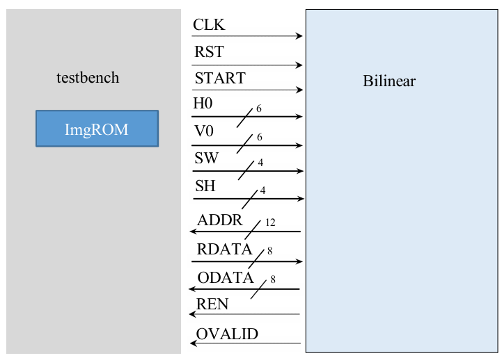
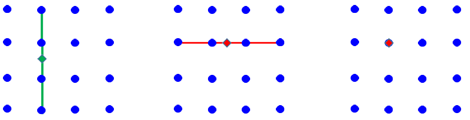
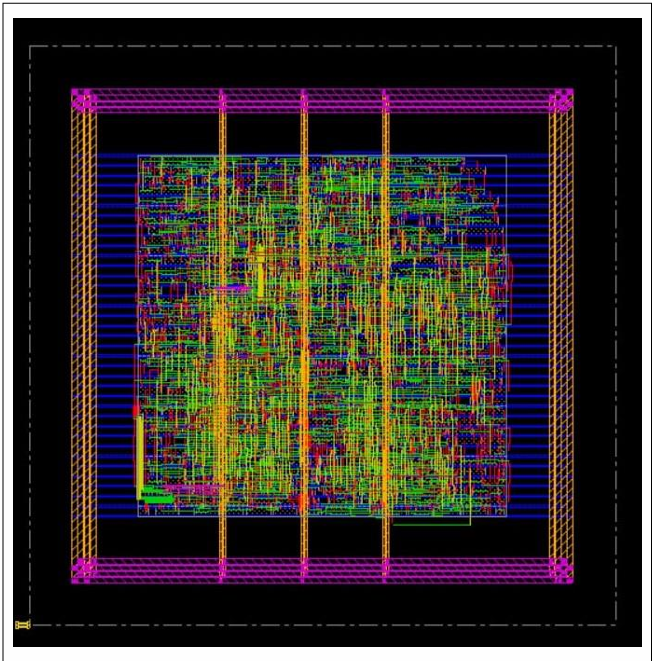

# Bilinear Resize Engine Design  
> This is my self-practice project. Therefore, I did not optimize my circuit design.  
> By the benefit from my good hardware structure, my performance still can rank 8th place of 46 teams.  
> Please check out the pdf to get more information about this project.  

## 1. Problem Description
Design a Bilinear Resize Engine circuit to enlarge a selected 2D matrix to the required size, commonly used for enlarging image selection areas.

### Detailed Specifications
- **Inputs and Outputs:** Described in Table 1.
- **Design Specifications:** Detailed in the following sections with required testbench for design verification.

## 2. Design Specifications

### 2.1 System Block Diagram

- **Inputs:**
  - CLK
  - RST
  - START
  - H0, V0 (coordinates of the top-left corner of the region to be processed)
  - SW (width of the region)
  - SH (height of the region)
- **Outputs:**
  - ADDR (address to read from ImgROM)
  - R_DATA (data read from ImgROM)
  - O_DATA (resized data)
  - REN (read enable signal)
  - O_VALID (output valid signal)

### 2.2 Input/Output Interface
| Signal Name | I/O | Width | Description |
|-------------|-----|-------|-------------|
| CLK         | I   | 1     | System clock |
| RST         | I   | 1     | Reset signal (active high) |
| START       | I   | 1     | Start signal for processing |
| H0          | I   | 6     | H coordinate (0-63) of the top-left corner |
| V0          | I   | 6     | V coordinate (0-63) of the top-left corner |
| SW          | I   | 4     | Width of the region (H0+SW < 63) |
| SH          | I   | 4     | Height of the region (V0+SH < 63) |
| ADDR        | O   | 12    | Address for ImgROM |
| R_DATA      | I   | 8     | Data from ImgROM |
| O_DATA      | O   | 8     | Resized output data |
| REN         | O   | 1     | Read enable (active low) |
| O_VALID     | O   | 1     | Output valid signal |

### 2.3 System Description
The Bilinear circuit enlarges a specified region from a 64x64 image stored in ImgROM to a 17x17 image. The process involves reading the original image data and applying bilinear interpolation.

### 2.3.1 Image Data Acquisition
The original 64x64 image data is stored in ImgROM, with each pixel being an 8-bit unsigned integer.

### 2.3.2 Determining Interpolation Points
To interpolate a point in the enlarged image, corresponding points in the original image are identified. Linear interpolation is applied to find these points.

### 2.3.3 1D Interpolation
Linear interpolation formula:
If we know p(1) and p(0), we want to find out p(x) (0<= x <=1)   
[ p(x) = p(0) + x * ( p(1)-p(0) ) ]

### 2.3.4 2D Bilinear Interpolation
Bilinear interpolation uses four points (a, b, c, d) around the target point to calculate the interpolated value. The process involves two stages of 1D linear interpolation.

## Implementation Details
I only use 4 DFFs to handle all the situation of resizing, which can largely reduce my circuit area.

## Final layout of the circuit

